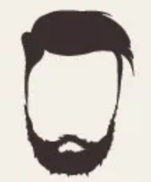
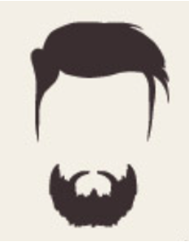
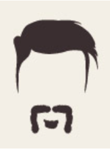
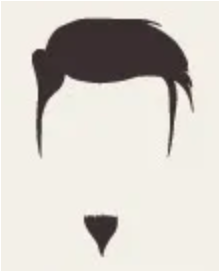
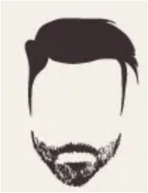
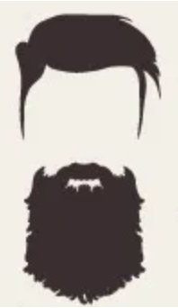

```{r, include = FALSE}
knitr::opts_chunk$set(
  collapse = TRUE,
  comment = "#>",
  echo = TRUE,
  message = FALSE
)
```

```{r setup}
library(NaileR)
```

`NaileR` in an R package that uses convenience functions offered by the `FactoMineR` package (`condes()`, `catdes()`, `descfreq()`) in conjunction with the `ollamar` package.

Its two main goals are to:

* generate latent variables descriptions with the help of large language models;
* offer similarity measure tools for textual data.

The purpose of this document is to introduce 3 of the most important features of the `Nailer` package.

# The beards case study

For this study, 62 respondents rated 8 pictures of beards by answering the following question: "In 3 words, please describe the person who is wearing this beard."

<div style="text-align: center;">
  <table style="margin: 0 auto;">
  <tr>
    <td></td>
    <td></td>
    <td></td>
    <td></td>
  </tr>
  <tr>
    <td></td>
    <td></td>
    <td></td>
    <td></td>
  </tr>
  </table>
</div>

## The beards dataset

The data were collected in the form of a contingency table with the beards in the rows and the words used to describe the beards in the columns: at the intersection of a row and a column, the number of times a word was used to describe a beard was noted.

```{r}
library(NaileR)
data('beard_cont')
beard_cont[,sample(1:336, 15)]
```

To illustrate this data table, we have extracted 15 words from the 336 used.

## The research questions

* First, we want to get a description of each beard according to the words used to describe it.

* Secondly, we want a multivariate representation of the beards and we want to understand the underlying structure between the beards: what is the principal element that sets the beards apart?

## The `nail_descfreq()` and `nail_condes()` functions

### Getting a description and an interpretation of the rows of a contingency table with the `nail_descfreq()` function

We provide the function with a clear, unambiguous introduction and request. Groups are not isolated to allow the LLM to draw comparisons between them, so that the final descriptions are more distinct from one another.

```{r cache=TRUE}
introduction <- 'A survey was conducted about beards and 8 types of beards were described. In the data that follows, beards are named B1 to B8.'
request <- 'Please give a name to each beard and summarise what makes this beard unique.'


res_beard <- nail_descfreq(beard_cont, introduction = introduction, request = request, isolate.groups = F, generate = T)
```


```{r}
cat(res_beard$response)
```

### Getting a multivariate representation of the beards and an interpretation of their underlying structure with the `nail_condes()` function

Let's extract the new names of the rows.

```{r}
text <- res_beard$response

titles <- stringr::str_extract_all(text, "\\\\*\\\\*B[0-9]+: [^\\\\*\\\\*]+\\\\*\\\\*")[[1]]
titles <- stringr::str_replace_all(titles, "\\\\*\\\\*", "")  # remove asterisks

names <- stringr::str_extract(titles, ": .+")
names <- stringr::str_replace_all(names, ": ", "")  # remove the colon and space

rownames(beard_cont) <- names
beard_cont[,sample(1:336, 8)]
```

Then, let's run a correspondence analysis on our dataset.

```{r cache=TRUE}
library(FactoMineR)
res_ca_beard <- CA(beard_cont, graph = F)
plot.CA(res_ca_beard, invisible = "col", title = "Names have been generated by Llama3")
```

Let's now replace the names with the pictures of the beards that have been evaluated.

```{r}
library(ggplot2)
library(ggimage)

d <- data.frame(x = res_ca_beard$row$coord[,1],
                y = res_ca_beard$row$coord[,2],
                image = c("b1.png","b2.png","b3.png","b4.png","b5.png","b6.png","b7.png","b8.png")
)

ggplot(d, aes(x, y)) +
  coord_fixed() +
  geom_hline(yintercept = 0, linetype = "dashed") +
  geom_vline(xintercept = 0, linetype = "dashed") +
  geom_image(aes(image=image), size=.08) +
  labs(x = "Dim. 1", y = "Dim. 2") +
  theme_minimal()

```

And *voilà...* This representation speaks for itself. The names given to the beards using only the words and the language model are perfectly consistent with the images of the beards themselves.

To understand the underlying structure, let's use the `nail_condes()` function on the first dimension obtained from correspondence analysis.

Before generating the description of our first dimension by our LLM, we can have a look at the prompt generated by the `nail_condes()` function. As we are in a contingency table context where the columns are associated with words, we change the default categories to recode the data.

```{r cache=TRUE}
beard_work <- res_ca_beard$row$coord |> as.data.frame()
beard_work <- beard_work[,1] |> cbind(beard_cont)

res_beard <- nail_condes(beard_work, num.var = 1, quanti.threshold = 0.5, quanti.cat = c('Very often', 'Never', 'Sometimes'), introduction = "These data refer to 8 types of beards. Each beard was evaluated by 62 assessors.", request = "Please explain what differentiates beards on both sides of the scale. Then, give the scale a name.", generate = F)
cat(res_beard$prompt)
```

We can replace the generic terms used by default by the `nail_condes()` function with more specific terms. In our case, we will replace the term *individuals* by *beards*.

```{r cache=TRUE}
ppt <- stringr::str_replace_all(res_beard$prompt, 'individuals', 'beards')
cat(ppt)
```

Let's generate an answer to this prompt.

```{r cache=TRUE}
res_beard <- ollamar::generate(model = 'llama3', prompt = ppt, output = 'df')

cat(res_beard$response)
```

# The Local Food System case study

This work was carried out by Nel Hervé as part of her Master's degree. It was supervised by Sylvie Thoby and Sébastien Lê. It was funded by the PLAT4TERFOOD priority research programme (PEPR): Faced with climate change and an increase in food-related diseases, policy makers are looking for new ways to promote more sustainable consumption patterns and food systems. The development of local food systems (LFS) is presented as a potential solution. However, these systems are still vague and evolving, and quantitative data on them are still scarce.

For this project, we asked nearly 600 people to think about their "ideal" food system. We asked them to rate 45 claims that might characterize a food system. These claims were selected according to 5 dimensions: an environmental dimension, an ethical dimension, a human dimension, a governance dimension and finally an economic dimension.

## The Local Food System dataset

Imagine a food system that meets your values and needs, without compromising the ability of future generations to meet their own.
After weighing the pros and cons, this food system would...

**Scale:**

Very unacceptable → Unacceptable → Neither acceptable nor unacceptable → Acceptable → Very acceptable

**Statements related to the notion of environment:**

* Impose optimized and reasoned water management.

* Impose optimized and reasoned energy management.

* Impose customers to prioritize buying “ugly produce”.

* Limit imports of food that can be produced locally.

* Sell products that are out of season at a much higher price.

* Never sell packaged products when they can be sold in bulk.

* Only use renewable energy.

* Remove all synthetic chemicals from agriculture.

* Prioritize respect for biodiversity and nature over yield.

**Statements related to the notion of respect (ethics/culture):**

* Ban the import of food whose production does not respect human rights.

* Ban the sale of meat from animals whose welfare was not respected.

* Impose a fair redistribution of profits throughout the food chain.

* Trust science in the development of innovative technologies.

* Impose schools to teach the importance of good nutrition.

* Reduce the number of product references put on sale.

* Impose the food industry to increase the number of product references for specific diets.

* Regularly impose dishes from other cultures in collective catering.

* Impose a baseline amount of traditional local recipes in catering.

**Statements related to the notion of governance:**

* Let communities alone decide on food policies, possibly after consultation.

* Let local authorities alone decide on food policies, possibly after consultation.

* Let the State alone decide on food policies, possibly after consultation.

* Be monitored solely by non-governmental organizations.

* Have a citizens’ council without which no decisions could be taken.

* Never be financed or run by private players.

* Have to reach a unanimous agreement between all players before making a decision.

* Follow policies defined for a minimum of 10 years.

* Impose civic education courses, at school, to understand public decisions.

**Statements related to the notion of human (social/health):**

* Impose surplus food to be donated to disadvantaged populations.

* Limit meat to two days a week in collective catering.

* Ban all products that are too fatty and/or too sweet.

* Ban all ultra-processed products.

* Create urban gardens that citizens would be obligated to maintain.

* Redistribute the world’s food and water resources fairly.

* Impose an annual nutritional health checkup for everyone.

* Support, through taxes, aid programs for disadvantaged regions and populations.

* Impose a civic service for social and environmental purposes (gardening, food distribution...).

**Statements related to the notion of economics:**

* Tax food that was not produced and processed in France.

* Guarantee prices that are stable and profitable for the producer throughout the year.

* Impose an economic model based on barter (products or services).

* Support, through taxes, food companies that commit to sustainable food.

* Force wages to be redistributed, to pay better wages to physical and difficult jobs.

* Systematically favor supply from small producers and family farms.

* Systematically favor certified products (organic, PDO, Label Rouge...).

* Require all players, including consumers, to recycle their waste.

* Force food companies to invest in innovative technologies.

## The research questions

The aim of this study is to understand the variability of perceptions of a sustainable/local food. We try to create groups of respondents so that two respondents are in the same group if they have the same perception of a sustainable food system.

## The analysis with `NaileR`: the `nail_catdes()` function

We use the `FactoMineR` package to perform Hierarchical Clustering on Principal Components. First, we perform a Multiple Correspondence Analysis on the data.


```{r cache=TRUE}
library(FactoMineR)
data(local_food)

set.seed(1)
res_mca_food <- MCA(local_food, quali.sup = 46:63, ncp = 100, level.ventil = 0.05, graph = F)
plot.MCA(res_mca_food, choix = "ind", invisible = c("var", "quali.sup"), label = "none")
```

Then, we cluster the indviduals based on the results from MCA.

```{r cache=TRUE}
res_hcpc_food <- HCPC(res_mca_food, nb.clust = 3, graph = F)
plot.HCPC(res_hcpc_food, choice = "map", draw.tree = F, ind.names = F)
don_clust_food <- res_hcpc_food$data.clust
```

And finally, we give the dataset with the new clusters to the `nail_catdes()` function.

Note that here, due to the complexity of the categories, negative v-tests are dropped (**drop.negative = TRUE**) and groups are studied separately (**isolate.groups = TRUE**).

```{r cache=TRUE}
res_food <- nail_catdes(don_clust_food, num.var = ncol(don_clust_food), introduction = 'A study on sustainable food systems was led on several French participants. This study had 2 parts. In the first part, participants had to rate how acceptable "a food system that..." (e.g, "a food system that only uses renewable energy") was to them. In the second part, they had to say if they agreed or disagreed with some statements.', request = 'I will give you the answers from one group. Please explain who the individuals of this group are, what their beliefs are. Then, give this group a new name, and explain why you chose this name. Do not use 1st person ("I", "my"...) in your answer.', isolate.groups = T, drop.negative = T)
```

```{r}
res_food[[1]]$response |> cat()
```

```{r}
res_food[[2]]$response |> cat()
```

```{r}
res_food[[3]]$response |> cat()
```

